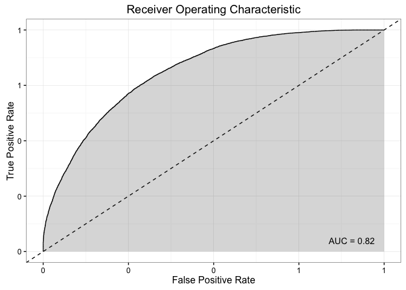
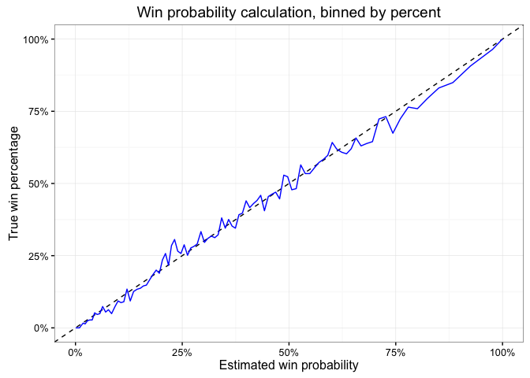
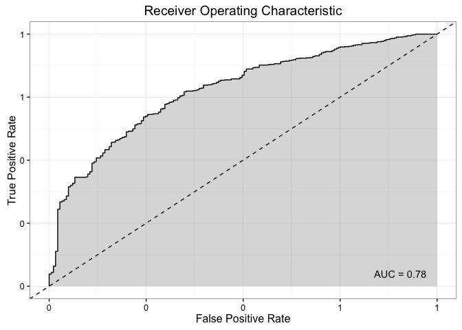
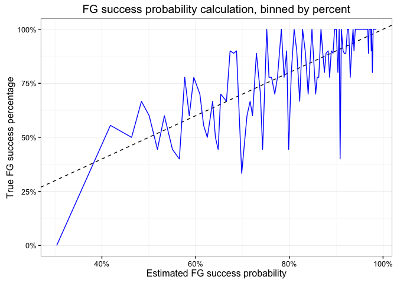
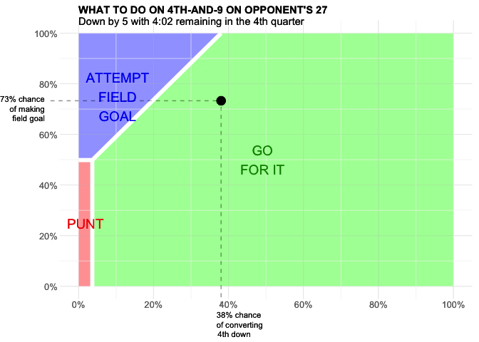

<!-- README.md is generated from README.Rmd. Please edit that file -->
This R package will eventually simplify a multitude of tasks when analyzing NFL play-by-play data. In its current iteration, it is based on the [New York Times 4th Down Bot](http://nyt4thdownbot.com/) ([Github repository](https://github.com/TheUpshot/4thdownbot-model)) and performs tasks limited to evaluating decisionmaking on 4th down plays. Using NFL play-by-play data from [Armchair Analysis](http://armchairanalysis.com/), this code will:

-   Munge the raw play-by-play data and transform it into a form suitable for modeling
-   Create a win probability model and serialize that model
-   Provide all of the functions to make optimal 4th down decisions for a given play

The Armchair Analysis data is *not free*. It costs $49 (one-time) to gain access to play-by-play data from the 2000-2014 NFL seasons. There is also a professional package that will provide weekly updates. Without the Armchair Analysis data, you will not be able to use much of this code.

Usage
=====

Unzip the play-by-play data into a directory. Run the following code from the directory where you want the Fourth Down Bot code to live. It will create the subdirectories `models` and `data` to store files. The significant difference from the NYT 4th Down Bot is a more basic field goal success prediction model (still a work-in-progress).

``` r
data_prep("data/armchair_analysis/")
model_train()
fg_model_train()
```

If you wish to view the calibration plots and ROC curves for the model, run `model_train` or `fg_model_train` with the `plot = TRUE` flag, like so (as you will see, the field goal model needs a lot more work to even match the current NYT model):

``` r
model_train(plot = TRUE)
#> Reading play by play data.
#> Splitting data into train/test sets
#> Scaling features.
#> Training model.
#> Making predictions on test set.
#> Evaluating model performance.
#> AUC: 0.816214460114287
#> Log loss: 0.490149526046311
#> 
#> Call: 
#> accuracy.meas(response = test_scaled$win, predicted = preds)
#> 
#> Examples are labelled as positive when predicted is greater than 0 
#> 
#> precision: 0.675
#> recall: 0.567
#> F: 0.616
#> F1 score: 0.616085102860218
```



    #> Press [enter] to continue



    #> Saving model and scaler.
    fg_model_train(plot = TRUE)
    #> Reading play by play data.
    #> Splitting data into train/test sets
    #> Training model.
    #> Making predictions on test set.
    #> Evaluating model performance.
    #> AUC: 0.778295082440171
    #> Log loss: 0.406635410492721
    #> 
    #> Call: 
    #> accuracy.meas(response = test$good, predicted = preds)
    #> 
    #> Examples are labelled as positive when predicted is greater than 0 
    #> 
    #> precision: 0.827
    #> recall: 0.977
    #> F: 0.895
    #> F1 score: 0.895272292040694



    #> Press [enter] to continue



    #> Saving model and scaler.

To evaluate the optimal decision, you must first load the already compiled data into your R workspace, then run the `run_bot` function. Currently you can only input your key information interactively via text prompts in R. Alternatively, for testing purposes you can use the `random_play` function to randomly generate fake data to test the package's functions. I am currently working on a better way to return summary information on this decision.

``` r
nfl_data <- load_data()
#> Loading data and setting up model.
results <- run_bot(nfl_data$data, nfl_data$win_model, nfl_data$fg_model, random_play(nfl_data$data))
plot_decision(results) %>%
  grid.draw
```



| Option         | Chance of Converting | Before Play | After Play | Change |
|:---------------|:---------------------|:------------|:-----------|:-------|
| Go for it      | 38%                  | 28%         | 27%        | -2%    |
| Punt           | --                   | 28%         | 20%        | -8%    |
| Field goal try | 73%                  | 28%         | 29%        | 0%     |
